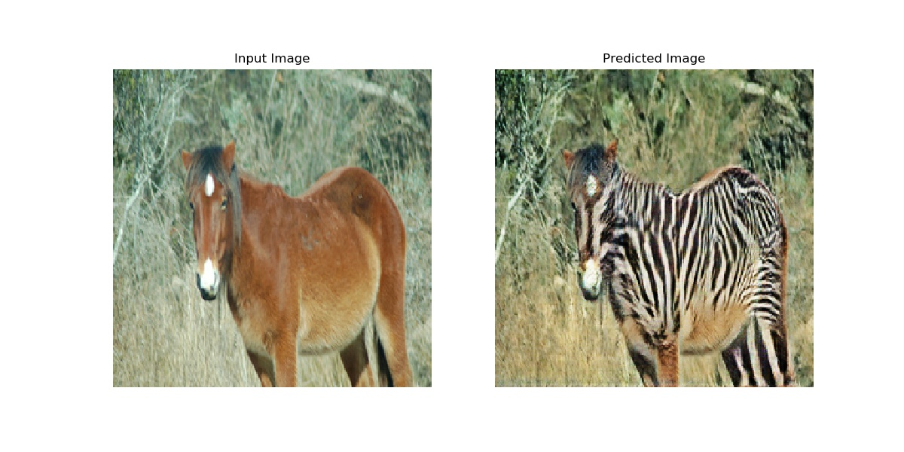
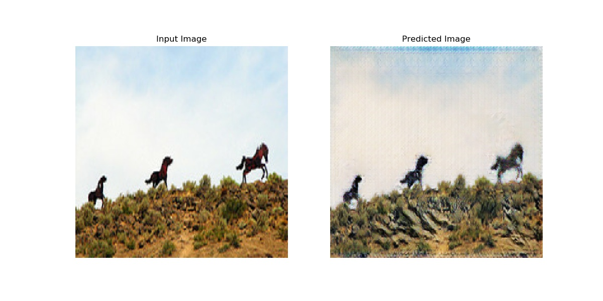
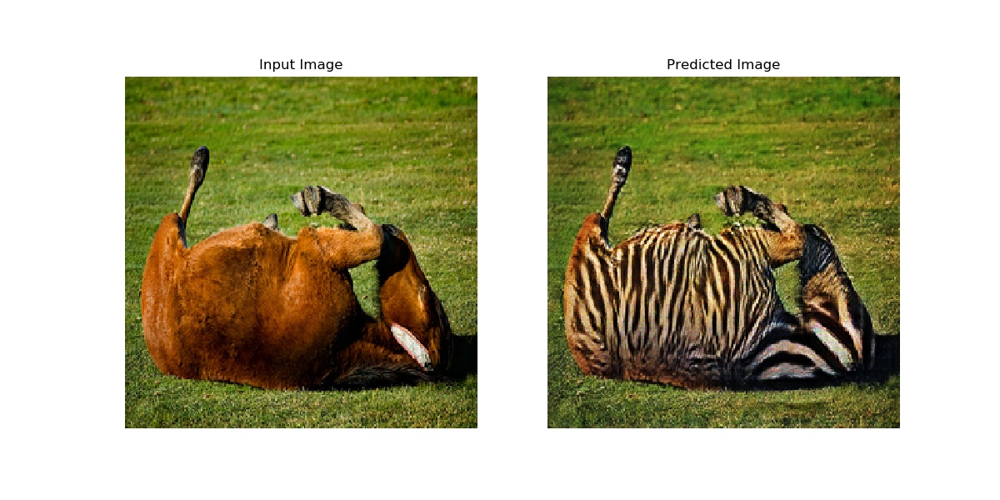
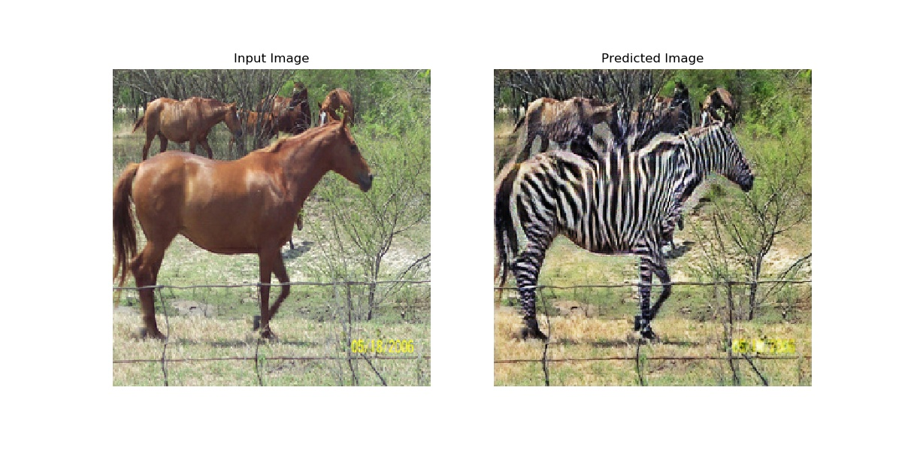

# CycleGAN
- Implementation of CycleGAN "Unpaired Image-to-Image Translation using Cycle-Consistent Adversarial Networks"    
- https://github.com/tensorflow/docs/blob/master/site/en/r2/tutorials/generative/cyclegan.ipynb
- The code is written with tensorflow eager execution (2.0)
## Train
- run `python cycleGAN.py` to train the model for 50 epochs
- the weights are stored in `weights/`, and generated image will saved in `generated_img/`
## Test
run `python test.py` to load weights from `weights/` and generate 5 images.
## Network Architecture
- The Generator is a *U-NET* and defined in `CycleGenerator.py`. The output is `tanh` activated.
- The Discriminator is a *PatchGAN* network with size 30*30.
## Data
- Use the package "tensorflow_datasets", horse to zebra.
- The dataset use `random_jitter` and `Nomalized` to [-1,1]
- The process in written in `data_preprocess.py`
## Hyper-parameter
- The `DropOut` is used in training and testing, according to the paper. There is no random vector `z` as input like
original GAN. The random of input is represented by dropout.
- In training, `BATCH_SIZE = 1` obtains better results. 
- Use 'instance batch normalization' defined in `instance_norm.py` rather than BatchNormalization.
## Generated image
   
   
    
    

